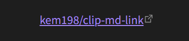

<!-- omit in toc -->
# clip-md-link

ウェブサイトのタイトルと URL を Markdown 形式でクリップボードへコピーするブックマークレットです。

例えばこの GitHub リポジトリページ上で実行すると、次の文字列を取得します。

```md
[kem198/clip-md-link](https://github.com/kem198/clip-md-link)
```

Obsidian などの Markdown エディタでプレビュー表示すると、次のようにリンク形式で表示されます。



<!-- omit in toc -->
## 目次

- [仕様](#仕様)
    - [タイトル / URL のエスケープ処理](#タイトル--url-のエスケープ処理)
    - [URL のデコード処理](#url-のデコード処理)
- [利用方法](#利用方法)
- [ライセンス](#ライセンス)
- [作成に利用したツール](#作成に利用したツール)
- [参考文献](#参考文献)

## 仕様

このブックマークレットには次の仕様が盛り込まれています。

### タイトル / URL のエスケープ処理

タイトル・URL において、次の文字をエスケープ処理 (`[` ⇒ `\[`) します。

- タイトル
    - (1) 角括弧記号 `[` `]`
    - (2) パイプ記号 `|`
    - (3) ハッシュ記号 `#`
- URL
    - (4) 丸括弧記号 `(` `)`

(1), (2), (4) の 3 点は参考サイト様からの引用です。

(3) についてはハッシュ記号 `#` をエスケープする文字として追加しています。Obsidian などの Markdown エディタにおいて、タイトルに含まれる `#` から続く文字列が [タグとして解析](https://publish.obsidian.md/help-ja/ガイド/タグの操作) されてしまうケースがあるためです。

### URL のデコード処理

日本語などのマルチバイト文字などを含む URL において、次の (B) の形式で取得できるようにしています。

```md
// (A) エンコードされた URL
[開発者向けのウェブ技術 \| MDN](https://developer.mozilla.org/ja/docs/Web#%E3%82%A6%E3%82%A7%E3%83%96%E9%96%8B%E7%99%BA%E8%80%85%E3%81%AE%E3%81%9F%E3%82%81%E3%81%AE%E3%83%89%E3%82%AD%E3%83%A5%E3%83%A1%E3%83%B3%E3%83%88)

// (B) デコードされた URL
[開発者向けのウェブ技術 \| MDN](https://developer.mozilla.org/ja/docs/Web#ウェブ開発者のためのドキュメント)
```

なお (B) の形式を正しく URL として解析できないエディタも存在します (サクラエディタなど) 。

また現行版では半角スペース ` ` などデコードすべきでない文字種も含めてデコードしてしまうため、ブラウザ側で正常に遷移ができない可能性もあります。

デコード処理を省いたものも用意しているので用途に応じてご使用ください。

## 利用方法

1. 適当なページをブックマークする。
2. ブックマークを次のとおり編集する。
    1. 名前: お好みの名前
    2. URL: 次のいずれかのコード全文を挿入する。

        デコード処理あり: [clip-md-link.js](clip-md-link.js)

        デコード処理なし: [clip-md-link-nondecord.js](clip-md-link-nondecord.js)

3. コピーしたいページで登録したブックマークをクリックする。
4. クリップボードへ書き込まれるので、エディタなどへペーストする (※) 。

(※) HTTPS 通信環境下でない場合、コピーされずにエラーメッセージを出力します。

(※) ブラウザのアクティブ状態などによってコピーできていないときがあります。うまくいかなかったらウェブページ内をクリックした上で再度ブックマークをクリックしてみてください。

## ライセンス

- [MIT License](LICENSE)

## 作成に利用したツール

- [改行・空白・タブ削除ツール｜ちょっと便利なツール・ジェネレーター置き場](https://html-css-javascript.com/n-space-tab/)
- [Bookmarklet Maker](https://caiorss.github.io/bookmarklet-maker/)

## 参考文献

- [Markdown/HTML用のリンクを作るbookmarklet \| 晴耕雨読](https://tex2e.github.io/blog/javascript/bookmarklet-for-links)
- [クリップボードとのやりとり - Mozilla \| MDN](https://developer.mozilla.org/ja/docs/Mozilla/Add-ons/WebExtensions/Interact_with_the_clipboard#ブラウザーの互換性)
